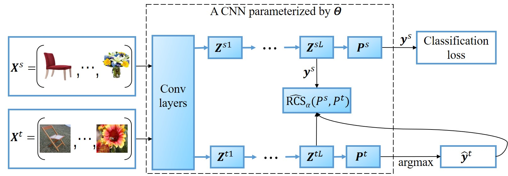

# Domain Neural Adaptation (DNA)

This repository contains a paper with supplementary material for the deep domain adaptation approach DNA, and and a pytorch implementation of the DNA approach.

In a nutshell, DNA solves the joint distribution mismatch problem in deep domain adaptation for large scale image recognition. To this end, it exploits a Convolutional Neural Network (CNN) to match the source and target joint distributions in the network representation space under the Relative Chi-Square (RCS) divergence. The following figure illustrates this deep joint distribution matching idea.   




##### Tested on
* Python 3.8
* PyTorch 1.11.0
* CUDA 11.4

#### Dataset folder
The folder structure required (e.g OfficeHome)
- data
  - OfficeHome
    - list
      - Art.txt
      - Clipart.txt
      - Prduct.txt
      - Real.txt
    - Art
    - Clipart
    - Product
    - Real


##### How to run

```bash
python  main_for_UDA.py --dataset officehome --source Product   --target Clipart   --phase pretrain --gpu 0 --start_update_step 2000 --update_interval 1000 --steps 70000 --message "JOINT" --alpha_div 0.5 --beta_div 0 --lambda_div 0.1 --patience 10
python main_for_UDA.py --dataset officehome --source Product   --target Clipart   --phase train --gpu 0 --start_update_step 2000 --update_interval 1000 --steps 70000 --message "JOINT" --alpha_div 0.5 --beta_div 0 --lambda_div 0.1 
```


For more details of this domain adaptation approach,  please refer to the following IEEE TNNLS work: 

@article{Chen2022Domain,  
  author={Chen, Sentao and Hong, Zijie and Harandi, Mehrtash and Yang, Xiaowei},  
  journal={IEEE Transactions on Neural Networks and Learning Systems},   
  title={Domain Neural Adaptation},   
  year={2022},  
  volume={},  
  number={},  
  pages={1-12},  
  doi={10.1109/TNNLS.2022.3151683}  
  }
  
The Pytorch codes are mainly provided by the second author Zijie Hong, and are currently maintained by Lisheng Wen. If you have any questions regarding the codes, please contact Lisheng Wen via the email wenlisheng992021@163.com.
